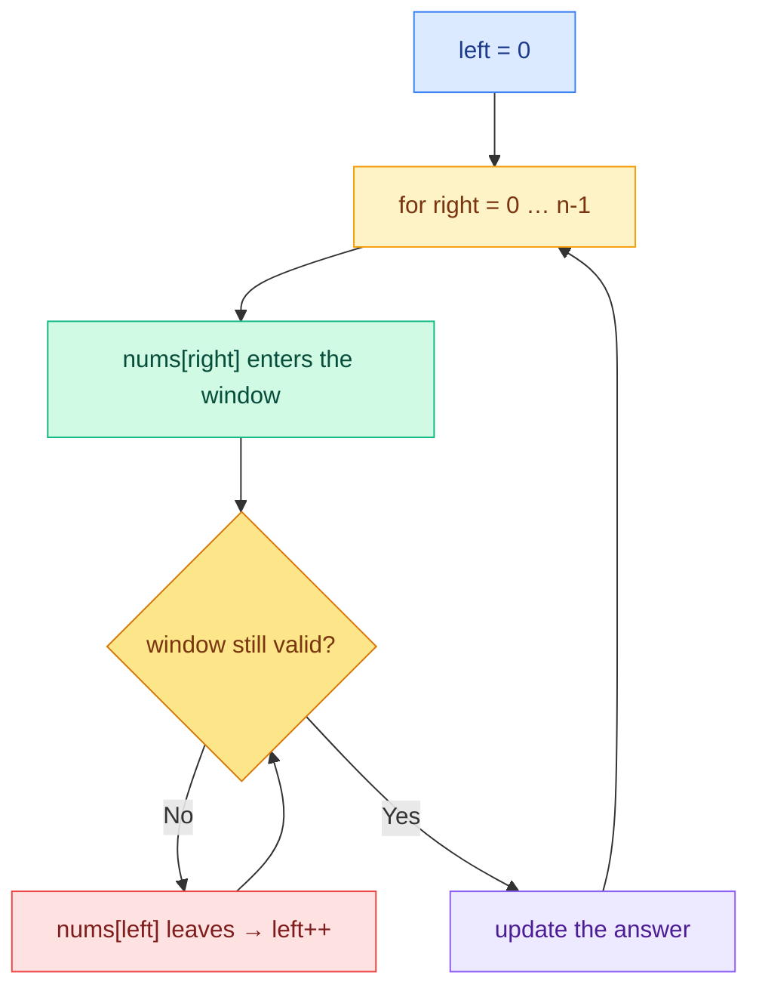

<div align="center">

# Sliding Window

### *Don't recompute the window: update it.*

[](#)
[-3B82F6?style=for-the-badge)](#complexity)
[%20or%20O(k)-8B5CF6?style=for-the-badge)](#complexity)
[](#)

</div>

---

## The drawing


> The drawing shows the **fixed** variant: a window of size `k = 3` slides over the array. The elements inside change, but the size stays `k`.

---

## The idea in one sentence

Instead of recomputing a subarray from scratch at every position (**O(n × k)**), you keep a **window** delimited by two indices (`left`, `right`) and **update** its state as it slides: one element enters, one leaves (**O(n)**).

```diff
+ RIGHT → expands the window: a new element ENTERS
- LEFT  → shrinks the window: the oldest element LEAVES
```

> [!IMPORTANT]
> **Sliding Window does not avoid scanning the array** — every element is still visited.
> What it avoids is **recomputing the window's information from scratch** at every step.

---

## The two variants

### 1. Fixed Sliding Window

The window always contains exactly `k` elements.

```text
k = 3

[2  3  5] 1  6  7  9  10      window = N[0], N[1], N[2]
 2 [3  5  1] 6  7  9  10      window = N[1], N[2], N[3]
 2  3 [5  1  6] 7  9  10      window = N[2], N[3], N[4]
```

At every step:

- the element at `right` **enters** the window;
- the element at `left` **leaves** the window;
- the size stays exactly `k`.

The trick that makes it fast — for example with a running sum:

```text
sum = sum
    - element that leaves   (nums[left])
    + element that enters   (nums[right])
```

One subtraction and one addition instead of `k` additions: this is what turns **O(n × k)** into **O(n)**.

### 2. Variable Sliding Window

The window has no fixed size: it **expands** while the condition holds and **shrinks** as soon as it breaks.



> [!TIP]
> `right` moves in the `for`, `left` moves in the `while`. Both pointers only ever move **forward**, so each element enters once and leaves once: **at most 2n steps in total**.

---

## The templates

### Fixed window (size `k`)

```javascript
let windowState = 0; // e.g. the sum of the window

// 1. Build the first window
for (let i = 0; i < k; i++) {
    windowState += nums[i];
}
let answer = windowState;

// 2. Slide it: one enters, one leaves
for (let right = k; right < nums.length; right++) {
    windowState += nums[right];        // enters
    windowState -= nums[right - k];    // leaves

    answer = Math.max(answer, windowState); // 3. Update the answer
}
```

### Variable window

```javascript
let left = 0;

for (let right = 0; right < nums.length; right++) {

    // 1. Expand: nums[right] enters the window

    while (/* window not valid */) {
        // 2. Shrink: nums[left] leaves the window
        left++;
    }

    // 3. Update the answer (the window [left, right] is valid here)
}
```

---

## Complexity

| Metric | Value | Why |
|:-------|:-----:|:----|
| **Time** | `O(n)` | `left` and `right` only move forward: each element enters and leaves the window **at most once** |
| **Space** | `O(1)` | Just a few variables for the window state (sum, count, …) |
| **Space** | `O(k)` | If the state needs a HashMap / Set (e.g. character frequencies) |

> [!NOTE]
> Compared to brute force: checking every subarray of size `k` costs `O(n × k)`, and checking *all* subarrays costs `O(n²)`. The window pays each element only twice: once in, once out.

---

## When to use it

You recognize the pattern when the problem talks about:

- **subarray** / **substring** (contiguous elements!)
- elements that are **consecutive** or a **window of size `k`**
- **max/min sum** of `k` consecutive elements
- **longest/shortest** interval satisfying a condition

> [!WARNING]
> The window works only on **contiguous** intervals. If the problem allows picking non-adjacent elements (subsequences), Sliding Window is the wrong tool.

**Fixed or variable?** If the problem states the size (`k` elements), it's fixed. If it asks for the *longest/shortest* interval with a property, it's variable.

---

## Classic problems to practice

Solutions live in the twin repo [sombreror/leetcode](https://github.com/sombreror/leetcode): every link in the *Solution* column leads to the write-up + runnable JavaScript code.

| Problem | Difficulty | Variant | Idea | Solution |
|:--------|:----------:|:-------:|:-----|:--------:|
| [Best Time to Buy and Sell Stock](https://leetcode.com/problems/best-time-to-buy-and-sell-stock/) | 🟢 Easy | Variable | Keep the minimum price on the left, expand right | [0121](https://github.com/sombreror/leetcode/tree/main/solutions/0121-best-time-to-buy-and-sell-stock) |
| [Maximum Average Subarray I](https://leetcode.com/problems/maximum-average-subarray-i/) | 🟢 Easy | Fixed | Running sum: `+ enters, − leaves` | — |
| [Longest Substring Without Repeating Characters](https://leetcode.com/problems/longest-substring-without-repeating-characters/) | 🟡 Medium | Variable | Set of seen chars; shrink on duplicate | [0003](https://github.com/sombreror/leetcode/tree/main/solutions/0003-longest-substring-without-repeating-characters) |
| [Longest Repeating Character Replacement](https://leetcode.com/problems/longest-repeating-character-replacement/) | 🟡 Medium | Variable | Window valid while `size − maxFreq ≤ k` | [0424](https://github.com/sombreror/leetcode/tree/main/solutions/0424-longest-repeating-character-replacement) |
| [Permutation in String](https://leetcode.com/problems/permutation-in-string/) | 🟡 Medium | Fixed | Window of size `s1.length` + frequency count | — |
| [Minimum Window Substring](https://leetcode.com/problems/minimum-window-substring/) | 🔴 Hard | Variable | Expand until valid, then shrink as much as possible | — |

---

<div align="center">

**[← Back to the pattern index](../../README.md)**

</div>
