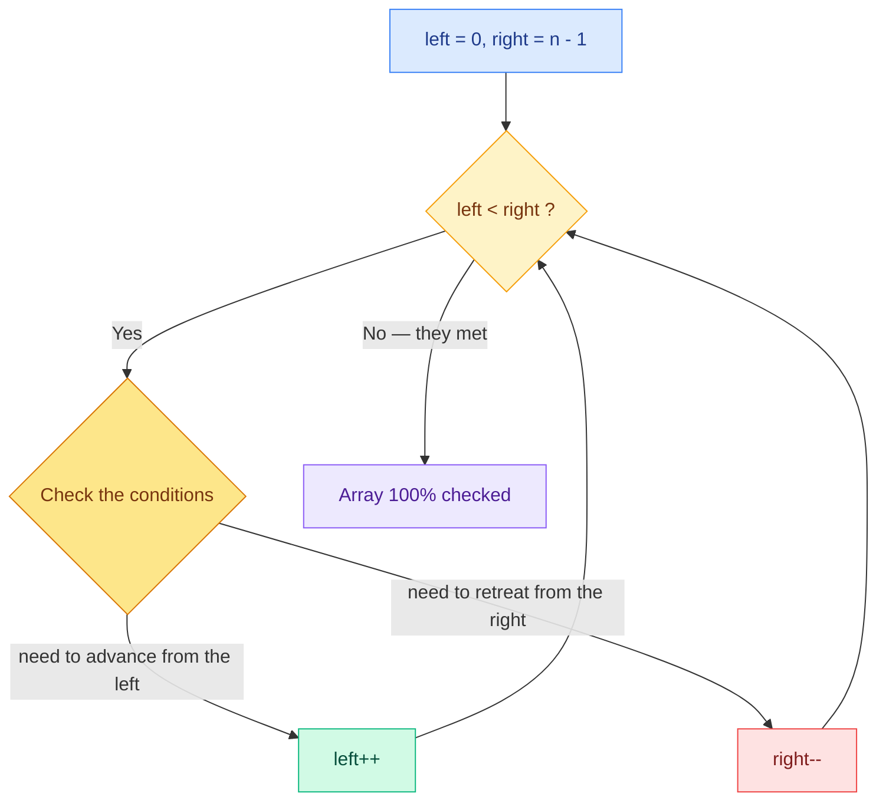

<div align="center">

# Two Pointers

### *Two indices, one pass: the array has no secrets left.*

[](#)
[-3B82F6?style=for-the-badge)](#complexity)
[-8B5CF6?style=for-the-badge)](#complexity)
[](#)

</div>

---

## The drawing


---

## The idea in one sentence

Instead of comparing every element against all the others (**O(n²)**), you use **two pointers** starting from opposite ends of the array, moving toward each other (**O(n)**).

```diff
+ LEFT  → starts on the left  and INCREASES (left++)
- RIGHT → starts on the right and DECREASES (right--)
```

The whole trick rests on one property of the [Array](../../Data%20Structures/Array/README.md): reading `array[i]` costs **O(1)**, so moving a pointer is free — the only thing that matters is *how many* moves you make.

> [!IMPORTANT]
> **When the two pointers meet, they have checked EVERY element of the array.**
> The meeting point is exactly where the `while` stops: it means the whole array has been scanned.

---

## How it works



1. **`left`** starts at the **first** element and moves right
2. **`right`** starts at the **last** element and moves left
3. On every iteration you check the problem's **conditions** and decide *which* pointer to move
4. When `left` and `right` meet, the loop ends: every element has been seen

> [!TIP]
> **The best technique is a `while`, not a `for`:** `while (left < right)` stops by itself *exactly* at the meeting point, with no need to precompute how many iterations are required.

---

## The template

```javascript
let left = 0;
let right = array.length - 1;

while (left < right) {

    if (/* condition: advance from the left */) {
        left++;
        continue;
    }

    if (/* condition: retreat from the right */) {
        right--;
        continue;
    }

    // here: left and right satisfy what we are looking for
    // → record the result, then move one (or both) pointers

} // end of while → left and right have met
```

Keep checking the conditions inside the loop to see whether they match what you are looking for, increasing `left` and decreasing `right` until they meet.

---

## Complexity

| Metric | Value | Why |
|:-------|:-----:|:----|
| **Time** | `O(n)` | Every element is visited **at most once**: the pointers only move toward each other |
| **Space** | `O(1)` | Only two variables are needed (`left`, `right`), no matter how big the array is |

> [!NOTE]
> Compared to brute force: two nested loops cost `O(n²)`. On an array of 1,000,000 elements that means **1,000,000,000,000 operations** versus **1,000,000**.

---

## The variants

This page covers the classic **converging** variant, but the same idea — two indices instead of two nested loops — comes in three shapes:

| Variant | Movement | Typical use |
|:--------|:---------|:------------|
| **Converging** (this page) | `left →` … `← right` from opposite ends | Palindromes, pair sums on sorted arrays |
| **Same direction** (read / write) | Both move left → right, at different speeds | Remove duplicates in place, partitioning |
| **Fast & Slow** | One moves 2 steps, the other 1 | Cycle detection, middle of a linked list *(gets its own pattern page)* |

> [!NOTE]
> [Sliding Window](../Sliding%20Window/README.md) is itself a same-direction two-pointers technique: `left` and `right` delimit the window.

---

## When to use it

You recognize the pattern when the problem shows these clues:

- The input is a **sorted array** or a **string**
- You are looking for a **pair** of elements satisfying a condition (sum, distance, …)
- You need to compare elements at **opposite ends** (e.g. palindromes)
- The brute-force solution would be `O(n²)` with two nested loops

> [!WARNING]
> The converging variant on pair-sum problems needs the array to be **sorted**: moving `left++`/`right--` is a deduction ("the sum is too small, so I need a bigger number") that only holds if the order is guaranteed. Unsorted input → sort first, or use a [Hash Map](../../Data%20Structures/Hash%20Map/README.md) (see Two Sum).

---

## Classic problems to practice

Solutions live in the twin repo [sombreror/leetcode](https://github.com/sombreror/leetcode): every link in the *Solution* column leads to the write-up + runnable JavaScript code.

| Problem | Difficulty | Idea | Solution |
|:--------|:----------:|:-----|:--------:|
| [Valid Palindrome](https://leetcode.com/problems/valid-palindrome/) | 🟢 Easy | Compare characters at both ends and squeeze toward the center | [0125](https://github.com/sombreror/leetcode/tree/main/solutions/0125-valid-palindrome) |
| [Two Sum II](https://leetcode.com/problems/two-sum-ii-input-array-is-sorted/) | 🟢 Easy | Sum too small? `left++` • Too big? `right--` | [0167](https://github.com/sombreror/leetcode/tree/main/solutions/0167-two-sum-II) |
| [Container With Most Water](https://leetcode.com/problems/container-with-most-water/) | 🟡 Medium | Always move the pointer at the shorter height | [0011](https://github.com/sombreror/leetcode/tree/main/solutions/0011-container-with-most-water) |
| [3Sum](https://leetcode.com/problems/3sum/) | 🟡 Medium | Fix one element + two pointers on the rest | [0015](https://github.com/sombreror/leetcode/tree/main/solutions/0015-3sum) |
| [Trapping Rain Water](https://leetcode.com/problems/trapping-rain-water/) | 🔴 Hard | Two pointers + max seen from each side | — |

---

<div align="center">

**[← Back to the pattern index](../../README.md)**

</div>
