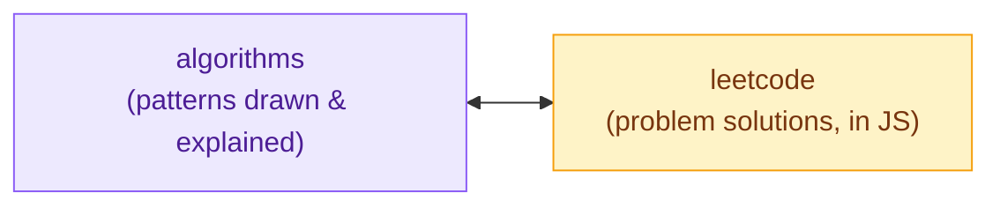
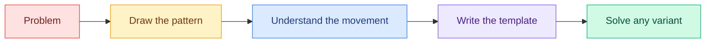

<div align="center">

# Algorithms — Visual Notes

### *Algorithms are understood with your eyes, not memorized.*

[](https://obsidian.md)
[](https://excalidraw.com)
[](https://github.com/sombreror/leetcode)

[](https://github.com/sombreror/algorithms/commits/main)
[](https://github.com/sombreror/algorithms/graphs/commit-activity)
[](#pattern-index)

</div>

---

## What is this repository

A collection of **visual notes on the most important algorithmic patterns**, hand-drawn with **Excalidraw** inside an **Obsidian** vault.

Every pattern gets its own folder containing:

| Content | Description |
|:--------|:------------|
| **Drawing** | The visual scheme of the pattern, drawn step by step |
| **Excalidraw note** | The source file, editable directly in Obsidian |
| **README** | The full write-up: how it works, code template, complexity, and classic problems |

> [!TIP]
> **Why visual?** An algorithmic pattern is not a formula to memorize — it is a *movement*. Watching pointers slide, windows glide, and trees split makes the concept impossible to forget.

---

## Pattern Index

| # | Pattern | Difficulty | Status |
|:-:|:--------|:----------:|:------:|
| 1 | **[Two Pointers](Two%20Pointers/README.md)** | 🟢 Easy | Done |
| 2 | Sliding Window | 🟢 Easy | Planned |
| 3 | Binary Search | 🟡 Medium | Planned |
| 4 | Fast & Slow Pointers | 🟡 Medium | Planned |
| 5 | BFS / DFS | 🟡 Medium | Planned |
| 6 | Dynamic Programming | 🔴 Hard | Planned |

> [!NOTE]
> This repository grows over time: every new pattern gets **drawn first**, then **explained**.
> The *Last commit* badge above always shows how fresh these notes are.

---

## Theory + Practice

This repo is the **theory**; the **practice** lives in the twin repo **[sombreror/leetcode](https://github.com/sombreror/leetcode)**, where every problem has its own write-up and a runnable JavaScript solution.



Inside each pattern README, the problems table links straight to **my actual solution** whenever one exists: study the pattern here, then go see how it was applied for real.

---

## How to use these notes

### From GitHub (read-only)
Browse the folders: every README shows the drawing and the full write-up. Nothing to install.

### From Obsidian (editable)
1. Clone the repository:
   ```bash
   git clone https://github.com/sombreror/algorithms.git
   ```
2. Open the folder as a **vault** in [Obsidian](https://obsidian.md)
3. Install the **Excalidraw** plugin (already configured in `.obsidian/`)
4. Open a note and switch to *Excalidraw View* to edit the drawings

---

## Philosophy



---

<div align="center">

**Notes by [sombreror](https://github.com/sombreror)**

*If these notes help you, leave a star.*

</div>
