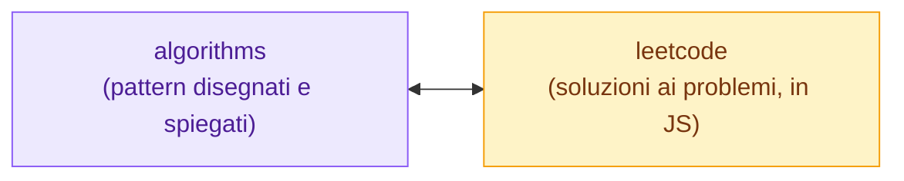
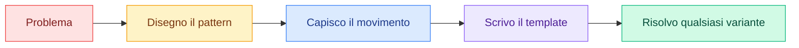

<div align="center">

# Algorithms — Appunti Visuali

### *Gli algoritmi si capiscono con gli occhi, non a memoria.*

[](https://obsidian.md)
[](https://excalidraw.com)
[](#)
[](#-roadmap)
[](https://github.com/sombreror/leetcode)

</div>

---

## Cos'è questo repository

Una raccolta di **appunti visuali sui pattern algoritmici** più importanti, disegnati a mano con **Excalidraw** dentro un vault **Obsidian**.

Ogni pattern ha la sua cartella con:

| Contenuto | Descrizione |
|:----------|:------------|
| **Disegno** | Lo schema visuale del pattern, disegnato passo passo |
| **Nota Excalidraw** | Il file sorgente, modificabile direttamente in Obsidian |
| **README** | La spiegazione completa: come funziona, template di codice, complessità e problemi classici |

> [!TIP]
> **Perché visuale?** Un pattern algoritmico non è una formula da imparare a memoria: è un *movimento*. Vedere i puntatori che si muovono, le finestre che scorrono, gli alberi che si dividono rende il concetto impossibile da dimenticare.

---

## Indice dei Pattern

| # | Pattern | Difficoltà | Stato |
|:-:|:--------|:----------:|:-----:|
| 1 | **[Two Pointers](Two%20Pointers/README.md)** | 🟢 Facile | Completo |
| 2 | Sliding Window | 🟢 Facile | In arrivo |
| 3 | Binary Search | 🟡 Media | In arrivo |
| 4 | Fast & Slow Pointers | 🟡 Media | In arrivo |
| 5 | BFS / DFS | 🟡 Media | In arrivo |
| 6 | Dynamic Programming | 🔴 Difficile | In arrivo |

> [!NOTE]
> Il repository cresce nel tempo: ogni nuovo pattern viene prima **disegnato**, poi **spiegato**.

---

## Teoria + Pratica

Questo repo è la **teoria**; la **pratica** vive nel repo gemello **[sombreror/leetcode](https://github.com/sombreror/leetcode)**, dove ogni problema ha il suo write-up e la soluzione JavaScript eseguibile.



Nei README dei pattern, la tabella dei problemi rimanda direttamente alla **mia soluzione** quando esiste: studi il pattern qui, poi vai a vedere come l'ho applicato davvero.

---

## Come usare questi appunti

### Da GitHub (solo lettura)
Sfoglia le cartelle: ogni README mostra il disegno e la spiegazione completa. Non serve installare nulla.

### Da Obsidian (modifica)
1. Clona il repository:
   ```bash
   git clone https://github.com/sombreror/algorithms.git
   ```
2. Apri la cartella come **vault** in [Obsidian](https://obsidian.md)
3. Installa il plugin **Excalidraw** (già configurato in `.obsidian/`)
4. Apri una nota e passa alla *Excalidraw View* per modificare i disegni

---

## Filosofia



---

<div align="center">

**Appunti di [sombreror](https://github.com/sombreror)**

*Se questi appunti ti sono utili, lascia una stella.*

</div>
