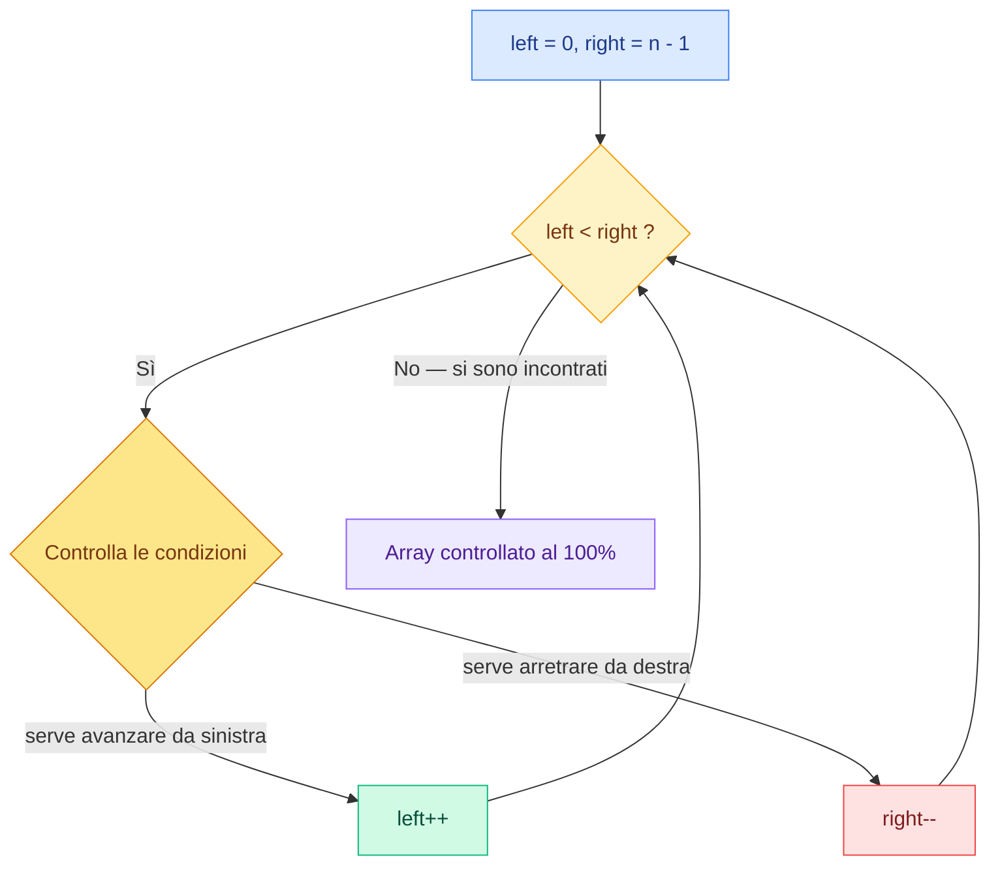

<div align="center">

# Two Pointers

### *Due indici, un solo passaggio: l'array non ha più segreti.*

[](#)
[-3B82F6?style=for-the-badge)](#-complessità)
[-8B5CF6?style=for-the-badge)](#-complessità)
[](#)

</div>

---

## Il disegno


---

## L'idea in una frase

Invece di confrontare ogni elemento con tutti gli altri (**O(n²)**), si usano **due puntatori** che partono dagli estremi opposti dell'array e si muovono uno verso l'altro (**O(n)**).

```diff
+ LEFT  → parte da sinistra e AUMENTA  (left++)
- RIGHT → parte da destra   e DIMINUISCE (right--)
```

> [!IMPORTANT]
> **Quando i due puntatori si incontrano, hanno controllato TUTTI gli elementi dell'array.**
> Il punto di incontro è esattamente il punto in cui si ferma il `while`: significa che abbiamo ciclato tutto l'array.

---

## Come funziona



1. **`left`** parte dal **primo** elemento e si muove verso destra
2. **`right`** parte dall'**ultimo** elemento e si muove verso sinistra
3. Ad ogni giro si controllano le **condizioni** del problema e si decide *quale* puntatore muovere
4. Quando `left` e `right` si incontrano, il ciclo termina: ogni elemento è stato visto

> [!TIP]
> **La tecnica migliore è usare un `while`**, non un `for`: il `while(left < right)` si ferma da solo *esattamente* nel punto di incontro, senza bisogno di calcolare prima quante iterazioni servono.

---

## Il template

```javascript
let left = 0;
let right = array.length - 1;

while (left < right) {

    if (/* condizione: serve avanzare da sinistra */) {
        left++;
        continue;
    }

    if (/* condizione: serve arretrare da destra */) {
        right--;
        continue;
    }

    // qui: left e right soddisfano ciò che cerchiamo
    // → salva il risultato, poi muovi uno (o entrambi) i puntatori

} // chiusura while → left e right si sono incontrati
```

Si continua con le condizioni all'interno per verificare se rispecchiano ciò che si cerca, aumentando `left` e diminuendo `right` fino all'incontro.

---

## Complessità

| Metrica | Valore | Perché |
|:--------|:------:|:-------|
| **Tempo** | `O(n)` | Ogni elemento viene visitato **al massimo una volta**: i puntatori si muovono solo l'uno verso l'altro |
| **Spazio** | `O(1)` | Servono solo due variabili (`left`, `right`), qualunque sia la dimensione dell'array |

> [!NOTE]
> Confronto con la forza bruta: due cicli annidati costano `O(n²)`. Su un array di 1.000.000 di elementi significa **1.000.000.000.000 di operazioni** contro **1.000.000**.

---

## Quando usarlo

Riconosci il pattern quando il problema ha questi indizi:

- L'input è un **array ordinato** o una **stringa**
- Cerchi una **coppia** di elementi che soddisfa una condizione (somma, distanza, …)
- Devi confrontare elementi **agli estremi opposti** (es. palindromi)
- La soluzione brute-force sarebbe `O(n²)` con due cicli annidati

---

## Problemi classici per allenarsi

| Problema | Difficoltà | Idea |
|:---------|:----------:|:-----|
| [Valid Palindrome](https://leetcode.com/problems/valid-palindrome/) | 🟢 Easy | Confronta i caratteri agli estremi e stringi verso il centro |
| [Two Sum II](https://leetcode.com/problems/two-sum-ii-input-array-is-sorted/) | 🟢 Easy | Somma troppo piccola? `left++` • Troppo grande? `right--` |
| [Container With Most Water](https://leetcode.com/problems/container-with-most-water/) | 🟡 Medium | Muovi sempre il puntatore con l'altezza minore |
| [3Sum](https://leetcode.com/problems/3sum/) | 🟡 Medium | Fissa un elemento + two pointers sul resto |
| [Trapping Rain Water](https://leetcode.com/problems/trapping-rain-water/) | 🔴 Hard | Two pointers + massimo visto da ciascun lato |

---

<div align="center">

**[← Torna all'indice dei pattern](../README.md)**

</div>
